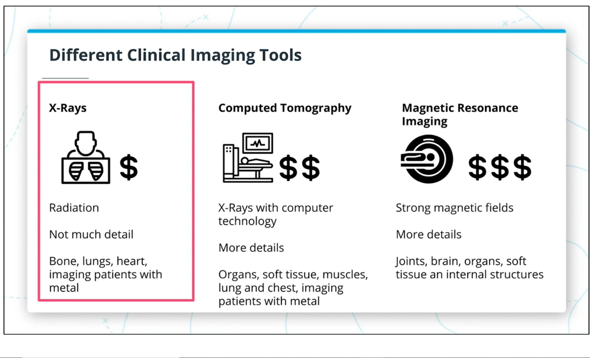

# Applying AI to 2D Medical Imaging

Logistic and statistical pattern recognition were first applied in medicine in the 1960s, but not for medical imaging. In 1980s, computers became more prevalent and they changed how the doctor would approach medical imaging problems. MRI was first applied clinically in the 1980s as well. Many classic machine learning models like support vector machines and random forests were not even invented until the mid-to-late 90s, but they quickly made their way into healthcare, with some specific use cases for medical imaging. 2012 saw the real promise for deep learning in general imaging problems, however, with the win of deep learning on the ImageNet challenge from there, it only took 5 years for the first deep learning algorithm to be FDA cleared for medical imaging.

For more information about the history of AI for medical imaging, read this [article](https://www.ncbi.nlm.nih.gov/pmc/articles/PMC6268174/) and this [article](https://www.sciencedirect.com/science/article/pii/S1939865419305041).

### The Problem & Opportunity

Physician burnout is a major topic of conversation in healthcare these days, and much of the burnout is due to the increased data that physicians are required to both input and consume about their patients. However, it presents great opportunities for AI, because AI can enhance efficiency, reduce human errors, and achieve goals with minimal human operation.

There's a time and a place for AI, and it should not be thrown at every problem that involves medical imaging.

For example, if the introduction of an AI algorithm is going to slow down a clinical workflow, this algorithm must significantly enhance another component of the clinical workflow (e.g. provide much higher accuracy than the current tools).

### Business Stakeholders

Academics, particularly computer & data scientists, have been developing algorithms to analyze medical images for a long time. The major stakeholders in the space are:

1. Clinical stakeholders: radiologists, primary care physicians, ER doctors, patients
2. Industry stakeholders: healthcare companies (e.g. Watson Health), medical device companies (e.g. Butterfly, Siemens
3. Regulatory stakeholders: FDA

## The Project

This project will:

1. Distill data that are useful for training algorithms to detect pneumonia from a giant set of chest x-ray images taken from actual patients.
2. Build a CNN model to detect the presence or absence of pneumonia.
3. Build wrappers that read medical images from their real-world clinical formats (DICOM).
4. Write up a documentation & validation plan of the algorithm for FDA 510(k) submission.

### Types of 2D Imaging

####  X-ray
The most common type of 2D imaging is x-ray. This technique uses a machine to emit x-rays, which are absorbed differently by different tissues in the body. Bone has high absorption and therefore appears bright white. Soft tissues like the heart and diaphragm absorb a medium amount and appear gray. Air does not absorb any x-rays and thus appears black.

We usually think of x-rays to look for fractures/broken bones, but two of their other most common use cases are for assessing abnormalities in the lungs, and for assessing breast tissue (mammograms).

#### Ultrasound
Ultrasound is a type of 2D imaging technique that isn't covered in the video. It utilizes high-frequency sound waves beyond the audible limit of human hearing to generate images. Ultrasound waves travel through soft tissues or fluids and bounce back when it hits dense tissues. More waves bounce back if the tissue is denser. The waves that bounce back are captured to generate images. Ultrasound is very safe and commonly used during pregnancy.

#### Microscopy
Microscopy refers to physical slides of biological material taken from a patient that can be viewed at the cell-level through a microscope. These slides often have a stain applied to them that causes different cell structures to appear in different colors. These stains help pathologists tell the difference between cell structures.

#### Fundal Imaging
The fundus of the eye is the interior surface of the eye, and images can be taken of it to diagnose diabetic retinopathy. In this condition, blood vessels at the back of the eye become damaged, so fundal imaging particularly looks at the integrity of the tiny vessels in the eye.

#### Differences in the imaging techniques
Since fundal images and microscopy images are not acquired with a digital machine, they are not inherently digital like x-rays are. As a result, an additional step of digitizing these images is required before applying AI. Once microscopy and fundal images are digitized, much of the AI principals can be applied to them the same way that they can be applied to x-ray images.

The second difference is that X-ray images are stored as single-channel grayscale images, while microscopy and fundal images are stored as red-green-blue (RGB) three-channel images.

Another major difference is that x-rays are stored in the DICOM format, which is the standard file format for medical imaging data, while this does not apply to microscopy and fundal images. 

## Extras

